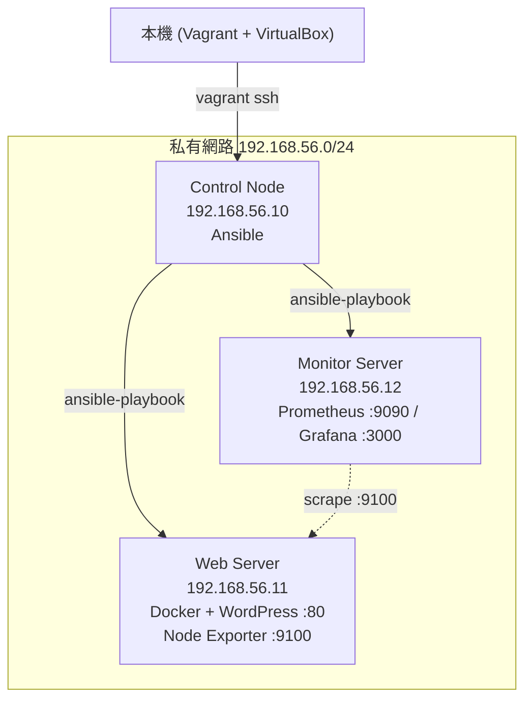

# Vagrant Ansible Three Node

三節點自動化部署實驗環境，使用 Vagrant 建立虛擬機，Ansible 自動化部署 Docker、WordPress 與 Prometheus/Grafana 監控系統。

## 架構圖



## 節點說明

| 節點 | IP | 角色 |
|------|----|------|
| control-node | 192.168.56.10 | Ansible 控制節點 |
| web-server | 192.168.56.11 | Docker + WordPress + Node Exporter |
| monitor-server | 192.168.56.12 | Prometheus + Grafana |

## 使用技術

- Vagrant + VirtualBox：建立多節點虛擬機環境
- Ansible：自動化部署（冪等性設計）
- Docker Compose：容器編排
- Prometheus + Grafana：系統監控與視覺化

## 啟動方式

```bash
git clone https://github.com/你的帳號/vagrant-ansible-infra.git
cd vagrant-ansible-infra
vagrant up
vagrant ssh control
cd ~/ansible-project
ansible-playbook deploy_docker.yml
ansible-playbook deploy_app.yml
ansible-playbook deploy_monitor.yml
ansible-playbook deploy_exporter.yml
```

瀏覽器驗證：
- WordPress：http://192.168.56.11
- Prometheus：http://192.168.56.12:9090
- Grafana：http://192.168.56.12:3000（預設帳密 admin/admin）

## 遇到的問題與解法

### 問題 1：No route to host（port 9100 無法連線）

Prometheus 採集 Node Exporter 時被 firewalld 擋住。

解法：用 Ansible 批量放行 port：
```bash
ansible webservers -m firewalld \
  -a "port=9100/tcp state=enabled permanent=yes immediate=yes" \
  --become -i hosts
```

### 問題 2：SSH 金鑰互通失敗

control 節點找不到 id_rsa.pub，導致 ssh-copy-id 失敗。

解法：重新執行 ssh-keygen 產生金鑰對，再 ssh-copy-id 到各節點：
```bash
ssh-keygen -t rsa -b 4096
ssh-copy-id vagrant@192.168.56.11
ssh-copy-id vagrant@192.168.56.12
```

### 問題 3：ansible ping 失敗

原因是 Rocky Linux 9 預設沒有安裝 ansible-core。

解法：
```bash
sudo dnf install epel-release -y && sudo dnf install ansible-core -y
```
